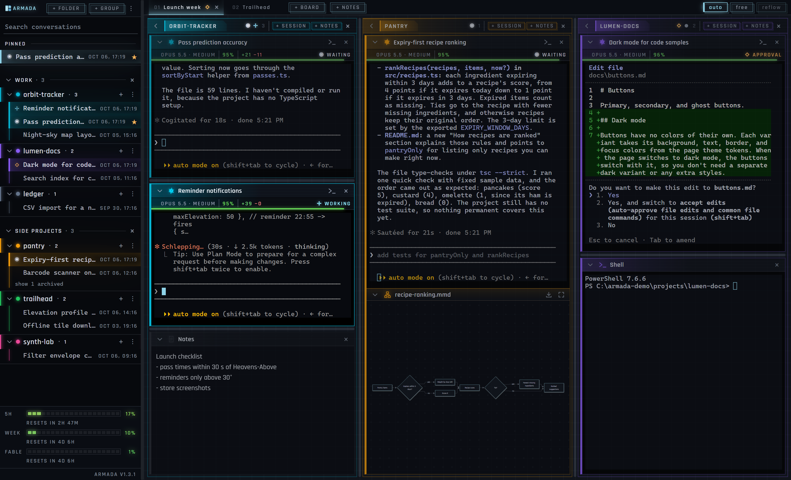
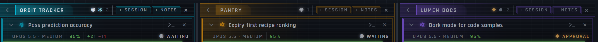
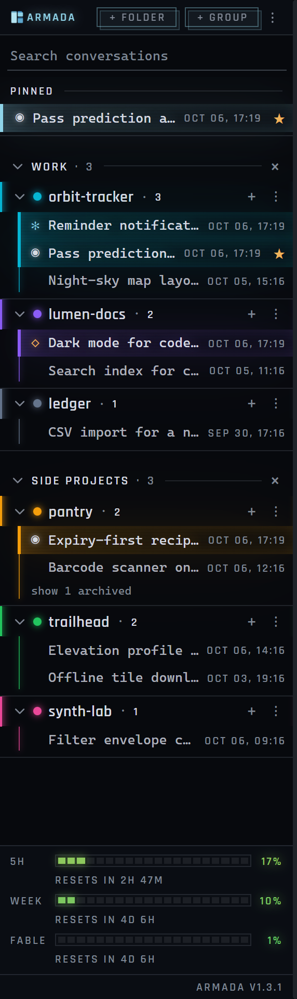
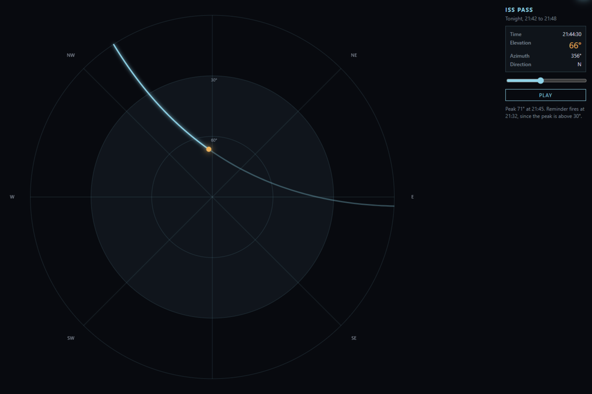
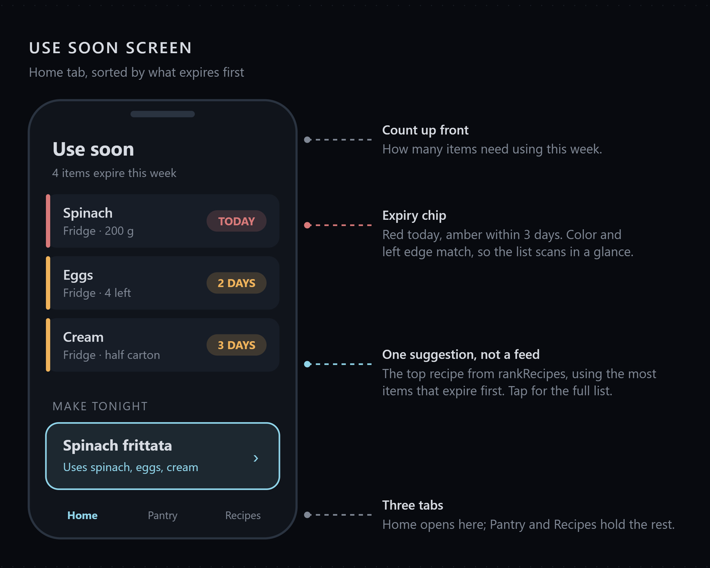
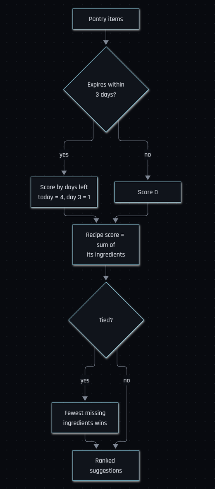

# Armada

A desktop dashboard for Claude Code. Every conversation you've had with `claude` becomes a live terminal tile you can
arrange on boards, grouped by project instead of scattered across windows.

Armada reads the conversations Claude Code already keeps on disk, so there's nothing to import. Open it and your
history is the sidebar.

Windows only for now. Install it from the latest release; see Get it running below.

## What it does

- Lists every project you've run Claude Code in, with its conversations underneath, most recent first. Click one and
  it opens as a live session.
- Groups tiles into boards, one tab each. Make one per project, per bug, whatever helps. Switching boards never
  interrupts a running session.
- Arranges tiles for you, or lets you place them freely. Rearranging never restarts a session.
- Shows what each session is doing (working, waiting on you, needs approval, idle) so you can tell which one wants
  attention without reading any of them. Each tile also shows its model, effort, context left, and the lines its
  session changed.

  
- Shows how much of your 5 hour, weekly and Fable limits you have left, and when each resets.
- Opens links, files and folders from the terminal with Ctrl+click.

## What's in it

- Three kinds of tile: **Claude** sessions, **Shell** tiles that open PowerShell in the same folder, and **Notes** for
  scratch.
- A color per project, worn by every tile, tab and lane from it.
- Sidebar housekeeping: rename, group, reorder, pin, archive and search, all saved between launches and none of it
  touching your files.

  

## Diagrams

Ask Claude to show you something and it draws it in a dock under its tile: an interactive page with sliders and
playback, a mockup of a screen, or a flowchart. Each one opens full view for a closer look and saves to a file.

  
  

## Get it running

You need Node.js 22 or newer on PATH (Claude Code runs Armada's hooks with it) and Claude Code from its native
installer, which provides `claude.exe` (the npm package's `claude.cmd` won't launch). PowerShell 7 is only needed for
shell tiles, VS Code only for the Open in VS Code menu.

Download `Armada-Setup-<version>.exe` from the [latest release](https://github.com/evanmassi/armada/releases/latest)
and run it. It installs for your user only, adds Armada to the Start Menu, and updates itself: a new release downloads
in the background and installs the next time you quit. Windows warns about an unknown publisher on first run because
the installer isn't signed; choose **More info**, then **Run anyway**.

On first launch a banner says Armada isn't connected to Claude Code. Click **Fix**. It adds a few hooks and a relay
around your status line in `~/.claude/settings.json`, so tiles can show what Claude is doing and the sidebar can show
your limits. Your status line looks the same, and nothing else in the file changes.

## Your data

Armada never changes your conversations. It reads them from `~/.claude/projects`, and only writes to
`~/.claude/settings.json` when you click **Fix**.

If you've moved Claude Code's folder with `CLAUDE_CONFIG_DIR`, Armada follows it.

Its own state (boards, tiles, colors, sidebar layout) lives in `%APPDATA%\armada\workspace.json`. Delete it and you're
back to a blank slate with every conversation still there. If something goes wrong, the last few lines of `armada.log`
in the same folder usually say why.

## Development

`npm run dev` runs **Armada Dev** with hot reload. It keeps its boards in `%APPDATA%\armada-dev`, so it runs beside the
installed Armada without touching your real workspace. Both copies list the same conversations; don't open one
conversation in both at once. How the code is organized, and the rules it follows, are in [AGENTS.md](AGENTS.md).

`npm run dev:demo` runs Armada Dev on made-up projects, conversations and boards under `C:\armada-demo`, with its own
Claude Code folder, so screenshots never show real work. Log in once inside a demo tile with `/login` and click **Fix**;
`npm run dev:demo -- --reset` puts the demo data back.

To release, run `npm version <x.y.z>` and `git push --follow-tags`. The tag builds the installer on GitHub and publishes
it as a release, which installed copies pick up on their next launch. `npm run dist` builds the same installer into
`dist/` locally without publishing.

## License

MIT
